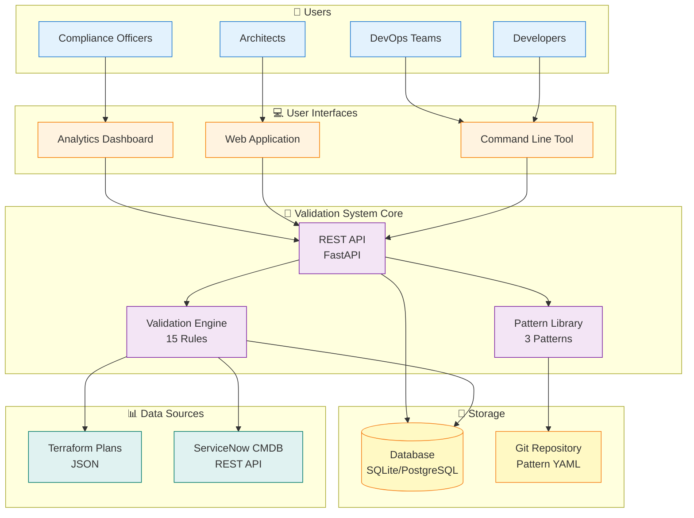
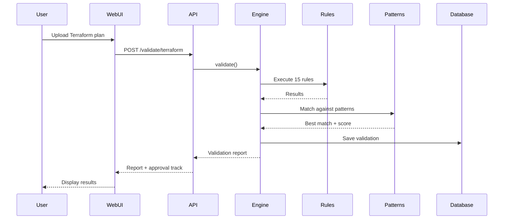

# Simple Architecture Overview

## High-Level System Architecture



## What Does It Do?

### 1. **Validates Infrastructure** 🔍
- Takes Terraform plans or CMDB data as input
- Runs 15 validation rules checking security, compliance, resilience, etc.
- Produces detailed validation reports

### 2. **Matches Patterns** 📐
- Compares infrastructure against approved architecture patterns
- Calculates similarity scores (0-100%)
- Identifies deviations from standard patterns

### 3. **Routes Approvals** ✅
- **95%+ match** → Fast Track (auto-approve eligible)
- **85-94% match** → Standard Review (2-3 days)
- **<85% match** → Full Review (architecture committee)

### 4. **Tracks Compliance** 📊
- Stores validation history in database
- Provides analytics and trends
- Shows pattern adoption metrics
- Tracks violation statistics

## Simple Validation Flow



## Key Components

### 🖥️ User Interfaces
- **CLI**: For scripts and CI/CD pipelines
- **Web UI**: For interactive validation
- **Dashboard**: For metrics and analytics

### ⚙️ Validation Engine
- Executes 15 rules in parallel
- Categories: Security, Network, Cost, Resilience, Technology, Metadata
- Severity levels: Critical, High, Medium, Low

### 📐 Pattern Library
- **PAT-001**: 3-Tier Web Application
- **PAT-002**: Microservices Architecture
- **COMP-001**: High Availability Database

### 💾 Database
- Validation history (audit trail)
- Pattern usage metrics
- Rule violations
- Compliance trends

## Quick Stats

| Metric | Value |
|--------|-------|
| Validation Rules | 15 |
| Reference Patterns | 3 |
| Rule Categories | 6 |
| API Endpoints | 20+ |
| Database Tables | 4 |
| Supported Sources | 2 (Terraform, CMDB) |

## Technology Stack

```
Frontend:  Bootstrap 5.3 + Chart.js + Vanilla JS
Backend:   Python 3.10+ + FastAPI + SQLAlchemy
Database:  SQLite (dev) / PostgreSQL (prod)
Deploy:    Docker + Docker Compose
CI/CD:     GitHub Actions
```

## Getting Started

1. **Install**
   ```bash
   pip install -r requirements.txt
   ```

2. **Configure**
   ```bash
   cp .env.example .env
   # Edit .env with your settings
   ```

3. **Run**
   ```bash
   # Start web server
   python -m uvicorn src.api.main:app --reload

   # Or use CLI
   python validate.py validate --terraform-plan plan.json
   ```

4. **Access**
   - Web UI: http://localhost:5000
   - Dashboard: http://localhost:5000/static/dashboard.html
   - API Docs: http://localhost:5000/api/docs

## Use Cases

### For Developers 👨‍💻
- Validate Terraform before applying
- Get instant feedback on architectural compliance
- See which approved pattern best matches their design

### For Architects 👷
- Define and maintain architecture patterns
- Review infrastructure against standards
- Track pattern adoption across teams

### For DevOps 🚀
- Integrate validation in CI/CD pipelines
- Automate architecture compliance checks
- Generate compliance reports

### For Compliance 📋
- Monitor overall compliance trends
- Identify most common violations
- Track remediation progress

## Common Workflows

### Workflow 1: Pre-Deployment Validation
```
Developer → Creates Terraform plan
         → Uploads to Web UI
         → Reviews validation results
         → Fixes violations
         → Re-validates
         → Deploys with confidence
```

### Workflow 2: CMDB Audit
```
Architect → Enters application ID
         → System queries CMDB
         → Validation runs automatically
         → Report shows deviations
         → Creates remediation tickets
```

### Workflow 3: Compliance Reporting
```
Manager → Opens Analytics Dashboard
        → Views compliance trends
        → Identifies problem areas
        → Exports reports
        → Shares with stakeholders
```

## Security & Compliance

### Built-in Security Rules
- ✅ Database encryption required
- ✅ No direct web-to-database connections
- ✅ DMZ isolation enforced
- ✅ Backup requirements validated
- ✅ Multi-AZ deployment checked

### Network Security
- ✅ Public subnet restrictions
- ✅ SSL/TLS on load balancers
- ✅ VPC flow logs enabled

### Compliance Standards
- PCI-DSS
- SOX (Sarbanes-Oxley)
- SOC2
- Cloud-Native best practices

## What's Next?

### v0.3.0 (Planned)
- PDF report generation
- Email notifications
- Scheduled validation runs
- Cost estimation per pattern

### v0.4.0 (Planned)
- Authentication & authorization
- Multi-tenancy support
- ML-based pattern recommendations
- Advanced analytics

### v1.0.0 (Planned)
- Production-ready release
- High availability setup
- Enterprise SSO integration
- SLA compliance tracking

---

## Need More Details?

See the [Complete Architecture Diagram](ARCHITECTURE_DIAGRAM.md) for in-depth technical documentation.

---

*This simplified overview is designed for quick understanding. For complete technical details, consult the full documentation.*
